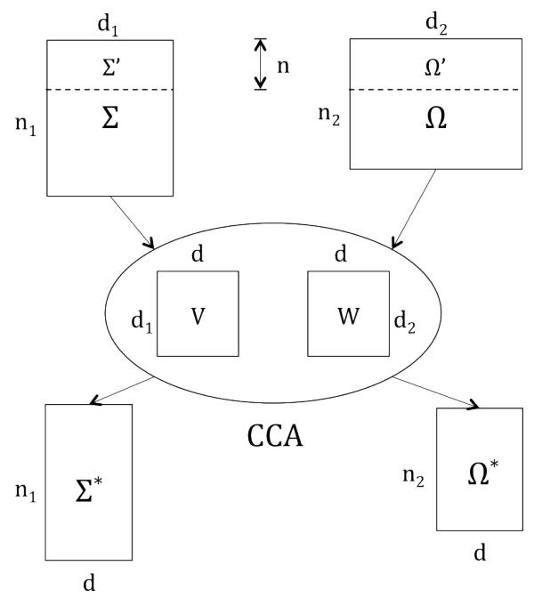
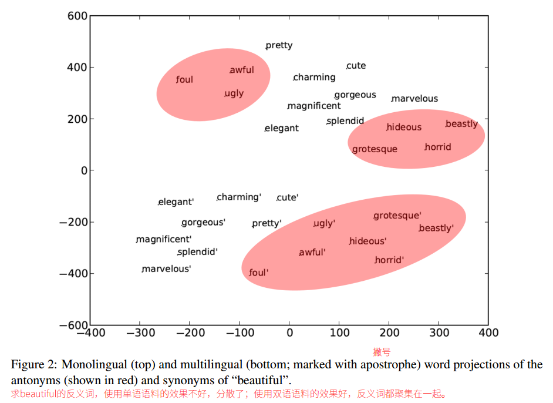

## Introduction

* **distributional hypothesis (Harris, 1954):**  the meaning of words is evidenced by the contexts they occur in.

* **This paper:** knowing how words translate is a valuable source of lexico-semantic information and should lead to better VSMs.

* **paraphrase and synonymy relationships (Bannard and CallisonBurch, 2005):** If different words or phrases in one language often translate into a single word or phrase type in a second language, this is good evidence that they are synonymous.
    * English words: aeroplane, airplane, and plane -> Chinese word: 飞机
    * then English words above have same meaning.

* **How** to use multilingual corpus?
    1. constructs **independent VSMs** in two languages.
    2. projects them onto a **common vector space** such that translation pairs should be maximally correlated. 

## CCA

* **Canonical correlation analysis (CCA)** is a way of measuring the linear relationship between two multidimensional variables.

* 

* $\Sigma \in \mathbb{R}^{n_1 \times d_1}$ 和 $\Omega \in \mathbb{R}^{n_2 \times d_2}$ 是两种语言各自词表的 embedding 查找表。每一行表示一个一个单词的 embedding。
* 显然，两种语言各自的词表大小 $n_1$ 和 $n_2$ 一般肯定不相等；各自训练的词向量维度 $d_1$ 和 $d_2$ 也不一定相等。
* 根据词对齐工具，找到两种语言中一一对应的词，分别是 $\Sigma ^{\prime} \in \mathbb{R}^{n \times d_1}$ 和 $\Omega ^{\prime} \in \mathbb{R}^{n_2 \times d_2}$。
* 现在从双方词表中取出两个对应词，记为 $x$ 和 $y$，对他们做投影转换到**共同空间**：$x_{1 \times d}^{\prime} = x_{1 \times d_1} \cdot v_{d_1 \times d}$，$y_{1 \times d}^{\prime} = y_{1 \times d_2} \cdot w_{d_2 \times d}$。
* 计算他们的相关度：
$$\rho(x^{\prime}, y^{\prime}) = \frac{E[x^{\prime} y^{\prime}]}{\sqrt{E[{x^{\prime}}^2]E[{y^{\prime}}^2]}}$$
* CCA的目的求出使得最大化这个相关度的投影向量v和w。
$$v, w = CCA(x,y)=argmax_{v,w} \rho(xv, yw)$$
* 现在一组词拓展成双语语料中所有对齐的词，则有向量形式改为矩阵形式：
$$V,W = CCA(\Sigma^{\prime}, \Omega^{\prime})$$
* 注意**共同空间**的维数$d=min\{rank(V), rank(W)\}$，所以共同空间的维数一定比原先两种语言各自embedding空间的维度要小。
* CCA同时解决了双语语料中没有对齐词的问题，只需将学得的V、W矩阵运用到这些词上即可。
$$\Sigma^{\star} = \Sigma V, \Omega^{\star} = \Omega W$$
* 也可以像PCA那样在d维只取前k个相关的维度。（实验结果表明大约取前80%的维度最好。）
* [MATLAB版本CCA工具](http://www.mathworks.com/help/stats/canoncorr.html)

## Data

* 语料：English, German, Spanishm French monilingual corpura [WMT-2011](http://www.statmt.org/wmt11/)

* 词对齐：关键词：[IBM模型](https://en.wikipedia.org/wiki/IBM_alignment_models)、[cdec工具](http://www.cdec-decoder.org/guide/fast_align.html)、Google翻译API都可以用。

## Evaluation

* **Word Similarity**
    * **WS-353 dataset**，细分成两个子数据集**WS-SIM(similarity)**和**WS-REL(relatedness)**。手工打分的各种词的相似度、相关度，353对。
    * **RG-65**，手工打分的名词相似度，65对。
    * **MC-30**，手工打分的名词相似度，30对。
    * **MTurk-287**，亚马逊土耳其机器人手工打分的各种词的相似度，287对。

* **Semantic Relations (SEM-REL)**
    * **Mikolov et al. (2013a) dataset**，语义相关性任务，如国家-首都：England : London :: France : Paris

* **Syntactic Relations (SYN-REL)**
    * **Mikolov et al. (2013a) dataset**，句法相关任务，共分成九大类相关：形容词-副词相关（adj-adv）、相反词（opposites）、比较级（comparative）、最高级（superlative）、现在分词-过去分词（present-participle）、国家-国籍（nation-nationality）、过去时（past tense）、复数名词（plural nouns）、复数动词（plural verbs）。

* 在以上多个数据集上评估，使用多种语言，使用多种词向量（通过LSA、词共现矩阵、SVD构造的embedding；RNN embedding；Skip-Gram embedding即word2vec）

* 将算法输出结果和人工结果进行Spearman相关度计算。

# Results

* 
* 
* 

# Conclusion

* 对于LSA这种distributional embedding而言，所有任务均有极大的提升。
* 对于ENN、Skip-Gram这种distributed embedding而言，提升反而不是很大。
* 据雪峰大佬说，用CCA融合双语语料做单语任务确实不会很好，表现不一；在做双语任务（如跨语言分类、抽双语词典）上会效果比较好。很可能CCA融合的双语语料对原有的单语词向量反而造成了破坏。

* Our work suggests that multilingual evidence is an important resource even for purely monolingual, semantically aware applications.
