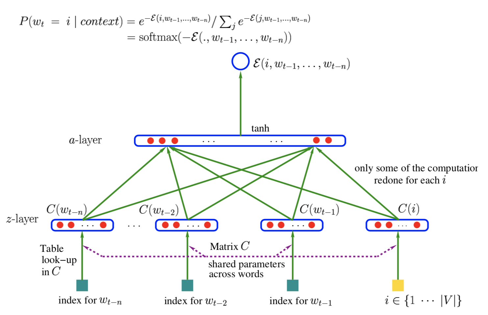

# Importance Sampling
## Abstract
The paper propose and evaluate sampling-based methods which require network passes only for the observed "**positive example**" and a few sampled **negative example word**s.
## Introduction
* Words can be **efficiently** represented by artificial neural network, where efficiently refers here to the statistical sense, meaning that **generalize well** and have **low perplexity**.

* However they are computationally **much more expensive** than n-grams.

* Goal : Speed up.
## Neural Architecture for Representing High-Dimensional Distributions
* 
* The output of the neural network depends on **the next word $w_{t}$** and **the previous words $h_{t}=(w_{t-1},w_{t-2},...,w_{t-n})$** as follows.

* In the features layer, one maps each word $w_{t-i}$ in $(w_{t-1},w_{t-2},...,w_{t-n})$ to a lower-dimensional continuous subspace $z_{i}$:
$$z_{i} = C_{w_{t-i}},i\in{0,1,...,n},$$$$z=(z_{0},z_{1},...,z_{n})$$ 
$C_{j}$: the j-th column of the **word features** matrix of free parameters. 
$z$: the input vector for the the hidden layer. (the **concatenation** of the projections $z_{i}$)

* The hidden layer:
$$a=tanh(d+Wz)$$
$d$: hidden units biases
$W$: hidden layer weights
$a$: a vector of hidden units activations.

* Finally, the output is a scalar energy function:
$$\varepsilon(w_{t},h_{t})=b_{w_{t}}+V_{w_{t}}\cdot a$$
$\varepsilon()$ is a parametrized function which is **low** for plausible configurations of $(w_{t},h_{t})$, and **high** for improbable ones.

* To obtain conditional probabilities, we **normalize** the exponentiated engergies:

$$P(w_{t}|h_{t})=\frac{e^{-\varepsilon (w_{t},h_{t})}}{\sum _{w'}e^{-\varepsilon (w',h_{t})}}$$

$$P(Y=y|X=x)=\frac{e^{-\varepsilon (y,x)}}{\sum _{y'}e^{-\varepsilon (y',x)}}$$

* The difficulty with these energy models is in learning the parameters of the engergy function, without an explict computation of the partition function (normalizing denominator, 归一化分母).

* CD算法 (Contrastive Divergence, Hinton 2002)
Contrastive Divergence is based on a sampling approximation of the log-likelihood gradient, $\frac{\partial logP(Y=y)}{\partial \theta }$. More generally, the gradient can be decomposed in two parts: positive reinforcement for $Y=y$ (the observed value) and negative reinforcement for every $y'$, weighted by $P(Y=y')$, as follows.
$$\frac{\partial logP(Y=y)}{\partial \theta }=-\frac{\partial\varepsilon (y)}{\partial \theta}+\sum_{y'}P(y')\frac{\partial \varepsilon(y')}{\partial \theta}$$
Speed up: Replace the right-hand above weighted average by **Monte-Carlo samples**.
How to sample: **Importance Sampling**
## Importance Sampling Approximation
引用1:
> Importance Sampling 也是借助了容易抽样的分布q（proposal distribution）来解决原始分布p难以找到的问题。
$$E[f]=\int f(z)p(z)\mathrm{d}z=\int f(z)\frac{p(z)}{q(z)}q(z)\mathrm{d}z\simeq \frac{1}{L}\sum_{l=1}^{L}\frac{p(z^{(l)})}{q(z^{(l)})}f(z^{l})$$
其中$\frac{p(z)}{q(z)}$可以看作importance weight。要引入什么样的分布q才会让采样的效果变得更好呢？直观的感觉是，样本的方差越小期望收敛速率越快。比如一次采样是 0, 一次采样是 1000, 平均值是 500,这样采样效果很差，如果一次采样是 499, 一次采样是 501, 你说期望是 500,可信度还比较高。在上式中，我们目标是 $p×f/q$ 方差越小越好，所以 $|p×f|$ 大的地方，proposal distribution $q(z)$ 也应该大。举个稍微极端的例子：

第一个图表示 $p$ 分布， 第二个图的阴影区域 $f = 1$，非阴影区域 $f = 0$, 那么一个良好的 $q$ 分布应该在左边箭头所指的区域有很高的分布概率，因为在其他区域的采样计算实际上都是无效的。这表明 Importance Sampling 有可能比用原来的$p$ 分布抽样更加有效。

引用2:
>让我们回顾一下期望的求法 $E(f(x))=\int (p(x)*f(x))\mathrm{d}x$。那么，现在我们引入另一个概率分布s(x)，相比于p(x)，s(x)是非常简单能找到cdf的。那么我们变形一下E(f(x)) = sum( p(x) * f(x) / s(x) * s(x) ) dx ，再仔细看看，这个求f(x)的期望变成了，求在s(x)分布下，p(x)*f(x)/s(x)的期望。
重要性采样的关键就在这里，把对f(x)不好求的期望，变成了一个在另一个分布下相对好求的期望。

详见论文

## 参考文献

https://www.cnblogs.com/xbinworld/p/4266146.html

http://blog.csdn.net/tudouniurou/article/details/6277526

https://zhuanlan.zhihu.com/p/29934206

http://www.jianshu.com/p/22fb279aa16b

