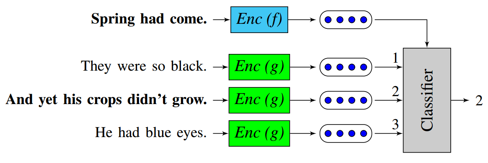

# A Model of Coherence Based on Distributed Sentence Representation

本文提出了一种基于分布式句子表示的模型，用来判断文本连贯性(Coherence)。模型的输入是多个句子（a window of sentences），输出是这些句子是连续的概率。模型的主要步骤如下：

1. 对每个句子进行编码：论文实现了循环神经网络编码和递归神经网络编码两种方式，将每个句子表示成一个$k \times 1​$的语义向量$h_{s_i}, i = 1,...,L​$，其中$L​$为句子个数（窗口大小）；
2. 将一个窗口内的所有句子的语义向量进行级联，得到大小为$(L \times k) \times 1​$的语义向量$h_C = [h_{s_1},h_{s_2},...,h_{s_L}]​$后，进行非线性变换，即$q_C=tanh(W_{sen} \times h_C + b_{sen})​$，得到大小为$H \times 1​$的隐藏层语义表示向量$q_C​$，其中$W_{sen}​$为大小为$H \times (L \times k)​$的矩阵，$b_{sen}​$为大小为$H \times 1​$的偏移向量；
3. 最后将$q_C​$输入到全连接层进行二分类，即$p(y_C=1) = sigmoid(U^Tq_C + b)​$，其中$y_C=1​$表示该窗口中的句子是连贯的，等于0则表示不连贯。

给定一篇包含$N_d$个句子的文档$d={s_1,s_2, ...,s_{N_d}}$，假设$L=3$，可以生成如下的样本：

$$
< s _ { \text{start} } , s _ { 1 } , s _ { 2 } > , < s _ { 1 } , s _ { 2 } , s _ { 3 } > , \ldots \\ < s _ { N _ { d } - 2 } , s _ { N _ { d } - 1 } , s _ { N _ { d } } > , < s _ { N _ { d } - 1 } , s _ { N _ { d } } , s _ { e n d } >
$$

文档$d$的连贯性得分$S_d$可以定义为所以样本连贯性概率的乘积（得分越大表示越连贯），即
$$
S _ { d } = \prod _ { C \in d } p \left( y _ { C } = 1 \right)
$$

虽然论文的任务是判断文本连贯性，给了后续的研究者研究句子分布式表示的启示:类似于word2vec中使用相邻词预测的方式来获得word embedding，可以通过句子连贯性这个任务自动构建数据集，无需标注即可得到sentence embedding。

# Skip-Thought Vectors

本文提出了Skip-Thought模型用于得到句子向量表示Skip-Thought Vectors。基本思想与word2vec中的skip-gram模型类似：对当前句子进行编码后对其周围的句子进行预测。具体地，skip-thought模型如下图，给定一个连续的句子三元组，对中间的句子进行编码，通过编码的句子向量预测前一个句子和后一个句子。Skip-Thought向量的实验结果表明，可以从相邻句子的内容推断出丰富的句子语义。

模型的基本架构与encoder-decoder模型类似，论文中使用的encoder和decoder都为GRU，使用单向GRU称为uni-skip,双向GRU称为bi-skip，将uni-skip和bi-skip生成的sentence embedding进行concat称为combine-skip。论文通过大量实验对比了上述三种变体的效果，总体上来说是uni-skip < bi-skip < combine-skip。包括如下实验：

1. 语义相关性：the SemEval 2014 Task 1: semantic relatedness SICK dataset 
2. 释义识别：Microsoft Research Paraphrase Corpus 
3. 图像检索（Image-sentence ranking）：the Microsoft COCO dataset 
4. 句子分类：MR、CR、SUBJ、MPQA以及TREC五个数据集

[词表扩展](https://github.com/tensorflow/models/tree/master/research/skip_thoughts#expanding-the-vocabulary)：skip-thought模型的词表规模往往是远小于现实中的词表（如用海量数据训练的word2vec）。为了让模型能够对任意句子进行编码，受论文[*Exploiting similarities among languages for machine translation*](https://arxiv.org/abs/1309.4168)的启发，本文训练一个线性映射模型，将word2vec的词向量映射为skip-thought模型encoder词表空间的词向量。假设训练后的skip-thought模型的词向量矩阵为X，大小为[num_words，dim1]，即词表大小为num_words，词向量维度为dim1，这num_words个词在word2vec中对应的词向量矩阵为Y，大小为[num_words, dim2]，即word2vec的词向量维度为dim2。我们的目的是word2vec中的词向量通过线性变换后得到词向量与skip-thought模型encoder空间的词向量无限接近，因此最小化线性回归$loss= || X - Y * W ||^2$。得到这个线性模型后，假设待编码的句子中的某个词不属于skip-thought词表，则首先在word2vec词表中进行look up得到word2vec对应的词向量，再通过线性模型映射为skip-thought模型encoder空间的词向量。

# Learning Distributed Representations of Sentences from Unlabelled Data

本文提出了两种无监督学习模型用于学习句子分布式表示。第一种模型称为**序列去噪自编码器**（SDAE: Sequential Denoising AutoEncoder）。AutoEncoder包括编码器和解码器两部分，输入信息通过编码器产生编码信息，再通过解码器得到输入信息，模型的目标是使输出信息和输入信息原来越接近。DAE (Denoising AutoEncoder)表示模型的输入信息首先经过了噪声处理后再进行编码和解码，并且希望解码的输出信息是不含噪声的输入信息，即去噪。DAE常用于图像处理，本文提出SDAE模型表示用来处理变长的句子（序列）。具体地，给定句子$S​$，采用噪声函数：$N(S|p_0,p_x)​$，其中$p_0, p_x​$为0到1之间的概率值。首先，对于$S​$中的每个词$w​$，噪声函数$N​$按照概率$p_0​$随机删除$w​$，然后对于$S​$中每个不重叠的bigram $w_iw_{i+1}​$，噪声函数$N​$按照概率$p_x​$对$w_i​$和$w_{i+1}​$进行交换。论文采用基于LSTM的encoder-decoder模型，SDAE的目标是预测出原始句子$S​$。SDAE模型在验证集上对超参数$p_0,p_x \in {0.1, 0.2,  0.3}​$进行搜索，得到当$p_0=p_x=0.1​$为最优结果。论文还尝试令$p_0=p_x=0​$进行对比实验，SDAE模型即变成了SAE模型。 SDAE模型相较于[Skip-Thought](https://github.com/llhthinker/NLP-Papers/blob/master/distributed%20representations/sentence-embedding/note.md#skip-thought-vectors)的优点是只需要输入单个句子，即不要求句子所在的文本是有序的，而Skip-Thought的输入必须是三个有序的句子。

第二种模型称为**FastSent**，[Skip-Thought](https://github.com/llhthinker/NLP-Papers/blob/master/distributed%20representations/sentence-embedding/note.md#skip-thought-vectors)模型采取语言模型形式的编码解码方式，导致其训练速度会很慢。FastSent采取了BOW形式的编码方式，使得模型训练速度大幅提高，因此称为FastSent。具体地，给定一个连续的句子三元组$S_{i-1}, S_i, S_{i+1}​$，对中间的句子$S_{i}​$进行编码，编码方式是$S_i​$中所有词的词向量之和，即$\mathbf { s } _ { \mathbf { i } } = \sum _ { w \in S _ { i } } u _ { w }​$，然后根据$\mathbf { s } _ { \mathbf { i } }​$对$w \in S_{i-1}  \cup S_{i+1}​$进行预测，这与word2vec模型中的skip-gram基本一致，而无需像Skip-Thought一样按照句子中词的顺序生成（预测）。因此FastSent的损失函数如下:
$$
\sum _ { w \in S _ { i - 1 } \cup S _ { i + 1 } } \phi \left( \mathbf { s } _ { \mathbf { i } } , v _ { w } \right)
$$
其中$\phi \left( v _ { 1 } , v _ { 2 } \right)​$为softmax函数，$v_w​$为目标句子中的词$w​$的embedding。论文还提出了一种变体模型FastSent+AE，该变体不光是预测前后两个句子中的词，还预测本身句子的词，损失函数即为：
$$
\sum _ { w \in S _ { i - 1 } \cup S _ { i } \cup S _ { i + 1 } } \phi \left( \mathbf { s _ { i } } , v _ { w } \right)
$$
模型训练后，测试阶段，FastSent能够通过计算句子中所有词向量的和迅速得到句子embedding，即：$\mathbf { s } = \sum _ { w \in S } u _ { w }​$。

论文通过两种类型的下游任务来评测句子分布式表示的质量，分别为监督类型（包括释义识别，文本分类）和非监督类型（语义相关性：SICK数据集与STS数据集，直接计算句子向量的余弦相似度并与人类打分进行比较）。实验结果为SDAE模型在监督类型评测上比CBOW（将CBOW类型词向量直接相加得到句子向量）和Skipgram等简单模型要好，但是在非监督类型评测上结果却相反。类似地，Skip-Thought模型在监督类型评测上比FastSent模型效果好，但在非监督类型评测上，FastSent要好于Skip-Thought。实验结果表明，**最佳方法主要取决于预期的应用。 更深，更复杂的模型（同时也需要更多的计算资源和训练时间）更适用于监督类型评测，但浅的对数线性模型更适合无监督类型评测**。

# A simple but tough-to-beat baseline for sentence embeddings

从论文题目可以看出，本文提出了一种非常简单但是具有一定竞争力的句子向量表示算法。算法包括两步，第一步是对句子中所有的词向量进行加权平均，得到平均向量$v_s$；第二步是移出（减去）$v_s$在所有句子向量组成的矩阵的第一个**主成分**(principal component /  singular vector)上的投影，因此该算法被简记为WR（W:weighting, R: removing）。

第一步主要是对TFIDF加权平均词向量表示句子的方法进行改进。论文提出了一种**平滑倒词频** (smooth inverse frequency, SIF)方法用于计算每个词的加权系数，具体地，词$w$的权重为$a / (a+p(w))$，其中$a$为平滑参数，$p(w)$为（估计的）词频。直观理解SIF，就是说频率越低的词在当前句子出现了，说明它在句子中的重要性更大，也就是加权系数更大。事实上，如果把一个句子认为是一篇文档并且假设该句中不出现重复的词（TF=1），那么TFIDF将演变成IF，即未平滑的倒词频。但是相较于TFIDF这种经验式公式，论文通过理论证明为SIF提供理论依据。对于第二步，个人的直观理解是移出所有句子的共有信息，因此保留下来的句子向量更能够表示本身并与其它句子向量产生差距。算法描述如下(其中$v_s, u$的shape均为[d, 1]，$uu^T$为[d,d]的矩阵，d为词向量维度)：

论文实验表明该方法具有不错的竞争力，在大部分数据集上都比完全平均或者使用TFIDF加权平均的效果好，在使用PSL作为词向量时甚至能达到最优结果。当然，由于PSL本身是基于有监督任务（短语对）来训练词向量，因此PSL+WR能在文本蕴含或相似度计算任务上达到甚至打败LSTM的效果也在情理之中。

# Unsupervised Learning of Sentence Embeddings using Compositional n-Gram Features 
本文是word2vec模型中CBOW形式的扩展，不仅仅使用窗口中的词来预测目标词，而是使用窗口中所有的n-grams来预测目标词（uni-gram）。为了得到句子向量，将句子看成一个完整的窗口，模型的输入为句子中的n-grams，目标是预测句子中的missing word(目标词），而句子向量是所有n-grams向量表示的平均。本文的模型与论文[*Enriching word vectors with subword information*(FastText)](https://github.com/llhthinker/NLP-Papers/blob/master/distributed%20representations/2017-11/Enriching%20Word%20Vectors%20with%20Subword%20Information/note.md)很类似，主要区别有两点，其一是本文的模型输入是词级别的n-grams序列而FastText是字符级别的n-grams序列，其二是本文最终的表示是对输入的n-grams embedding进行平均而FastText是相加。

# An efficient framework for learning sentence representations

本文提出了一种简单且有效的框架用于学习句子表示。和常规的编码解码类模型（如[skip-thoughts](https://github.com/llhthinker/NLP-Papers/blob/master/distributed%20representations/sentence-embedding/note.md#skip-thought-vectors)和[SDAE](https://github.com/llhthinker/NLP-Papers/blob/master/distributed%20representations/sentence-embedding/note.md#learning-distributed-representations-of-sentences-from-unlabelled-data)）不同的是，本文采用一种分类器的方式学习句子表示。具体地，模型的输入为一个句子$s$以及一个候选句子集合$S_{cand}$，其中$S_{cand}$包含一个句子$s_{ctxt}$是$s$的上下文句子（也就是$s$的前一个句子或后一个句子）以及其他不是$s$上下文的句子。模型通过对$s$以及$S_{cand}$中的每个句子进行编码，然后输入到一个分类器中，让分类器选出$S_{cand}$中的哪个句子是$s_{ctxt}$。实验设置候选句子集合大小为3，即$S_{cand}​$包含1个上下文句子和两个无关句子。模型结构如下：

模型有如下两个细节需要注意：

1. 模型使用的分类器（得分函数）$c$非常简单，是两个向量内积，即$c(u, v)=u^Tv$，计算$s$的embedding与所有$S_{cand}$中的句子向量内积得分后，输入到softmax层进行分类。使用简单分类器是为了引导模型着重训练句子编码器，因为我们的目的是为了得到好的句子向量表示而不是好的分类器。
2. 虽然某些监督任务模型如文本蕴含模型是参数共享的，$s$的编码器参数和候选句子编码器参数是不同的（不共享），因为句子表示学习往往是在大规模语料上进行训练，不必担心参数学习不充分的问题。测试时，给定待编码句子$s$，通过该模型得到的句子表示是两种编码器的连结 $[ f ( s ) ;g ( s ) ]$。

论文将上述模型命名为**quick thoughts**（**QT**），意味着该模型能够迅速有效地学习句子表示向量。模型使用GRU作为Encoder，为了和Skip-Tought模型进行比较，模型包含三种变体，使用单向GRU称为uni-QT，双向GRU称为bi-QT，将uni-QT和bi-QT生成的sentence embedding进行concat称为combine-QT。此外，论文将同时使用预训练词向量和随机初始化词向量的模型称为MultiChannel-QT（MC-QT）,这种设置是参照[multi-channel CNN模型](https://github.com/llhthinker/NLP-Papers/blob/master/text%20classification/2017-10/Convolutional%20Neural%20Networks%20for%20Sentence%20Classification/note.md#%E8%AE%BA%E6%96%87%E7%AC%94%E8%AE%B0convolutional-neural-networks-for-sentence-classification)。

论文通过多个句子分类任务证明QT模型了的优越性：

- 相较于其他无监督句子表示学习方法，QT在训练时间较少的情况下（相较于Skip-Thought、SDAE），能够达到非常不错的效果，在大多数数据集上的效果都是最好的。
- 与监督句子表示学习方法（如InferSent等）对比，QT（MC-QT）同样能够在大多数数据集上取得最优效果。
- 与专门用于句子分类任务模型（如CNN）对比，QT使用ensemble，考虑模型类型(单向/双向)，词向量（随机/预训练）以及数据集（BookCorpus/UMBC ）三个方面进行训练不同的模型进行集成，也取得了有竞争力的效果。

论文还通过image-sentence ranking和nearest neighbors两个实验来为QT有效性提供依据。

# Towards universal paraphrastic sentence embeddings

本文提出使用[PPDB(the Paraphrase Database)](http://www.aclweb.org/anthology/N13-1092)来学习通用的sentence embeddings。论文模型的基本流程是输入mini-batch的释义对$<x_1, x_2>$集合$X_b$，并通过对$X_b$中的句子进行采样得到$x_1,x_2$对应的负样本$t_1, t_2$，将这四个句子通过编码器（编码函数）$g$得到句子编码，然后使用一种 margin-based loss进行优化，损失函数的基本思想是**希望编码后的释义对$<x_1,x_2>$能够非常相近而非释义对$<x_1,t_1>$和$<x_2,t_2>$能够有不小于$\delta$的间距**。对于全体训练数据$X$，目标函数如下，其中$\lambda_c,\lambda_w$为正则化参数，$W_w$为word embedding参数，$W_{w_{initial}}$ 为word embedding初始化矩阵，$W_c$是除了$W_w$后的其他参数。

$$
\min _ { W _ { c } , W _ { w } } \frac { 1 } { | X | } \left( \sum _ { \left\langle x _ { 1 } , x _ { 2 } \right\rangle \in X } \max \left( 0 , \delta - \cos \left( g \left( x _ { 1 } \right) , g \left( x _ { 2 } \right) \right) + \cos \left( g \left( x _ { 1 } \right) , g \left( t _ { 1 } \right) \right) \right)\right. \\ + \max \left( 0 , \delta - \cos \left( g \left( x _ { 1 } \right) , g \left( x _ { 2 } \right) \right) + \cos \left( g \left( x _ { 2 } \right) , g \left( t _ { 2 } \right) \right) \right) \bigg) \\ + \lambda _ { c } \left\| W _ { c } \right\| ^ { 2 } + \lambda _ { w } \left\| W _ { w _ { i n i t i a l } } - W _ { w } \right\| ^ { 2 }
$$

论文实现了6种类型的编码函数$g$，具体如下：

1. 词向量平均；
2. 词向量平均后通过一个线性层；
3. [DAN模型](https://github.com/llhthinker/NLP-Papers/blob/master/text%20classification/2017-11/Deep%20Unordered%20Composition%20Rivals%20Syntactic%20Methods%20for%20Text%20Classification/note.md#deep-averaging-networks)：词向量平均后通过多层带非线性函数的全连接层；
4. Simple RNN，取最后一个隐状态向量；
5. identity-RNN (iRNN)， 一种特殊的simple RNN，其weight矩阵初始化为单位矩阵，bias初始化为0向量，激活函数为恒等函数，最终的句子编码向量为最后一个隐状态向量除以句子中词的个数。当正则化程度很高时（模型参数几乎不更新），iRNN将变成模型1（词向量平均），不同的是iRNN能够考虑词序，有希望能够比模型1效果好；
6. LSTM，取最后一个隐状态向量。

论文通过大量实验来对比上述6种编码器的优劣，得到如下结论：

- 对于无监督文本相似度任务，复杂的模型如LSTM在垂直领域数据集上表现更好，而对于开放域数据集，简单的模型如词向量平均比LSTM的效果更好；
- 对于句子相似度，句子蕴含以及情感分析这三种有监督任务，词向量平均模型在句子相似度和句子蕴含两个任务上表现比LSTM的效果更好，而情感分析任务LSTM表现非常不错。
