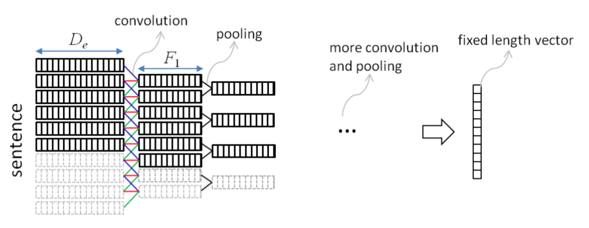
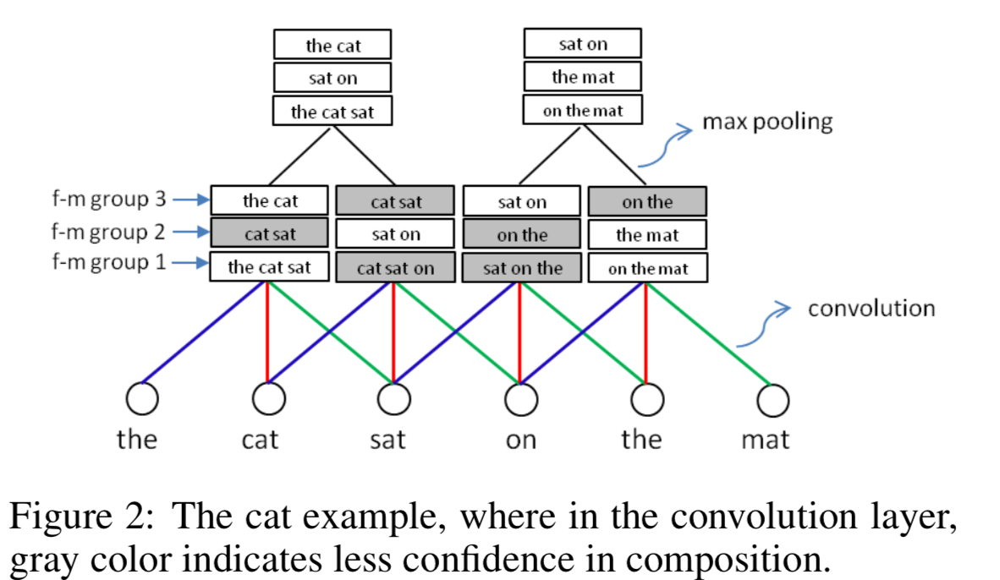
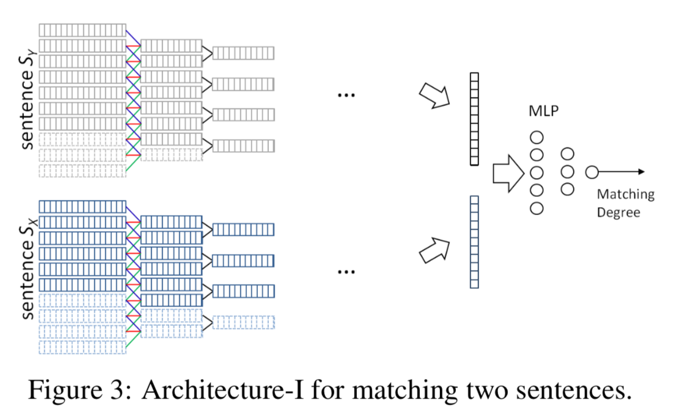
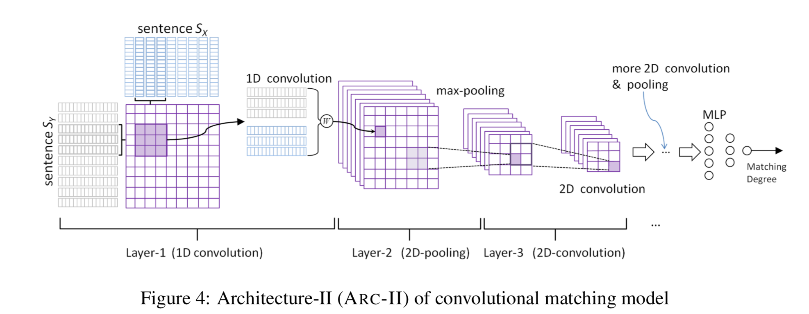
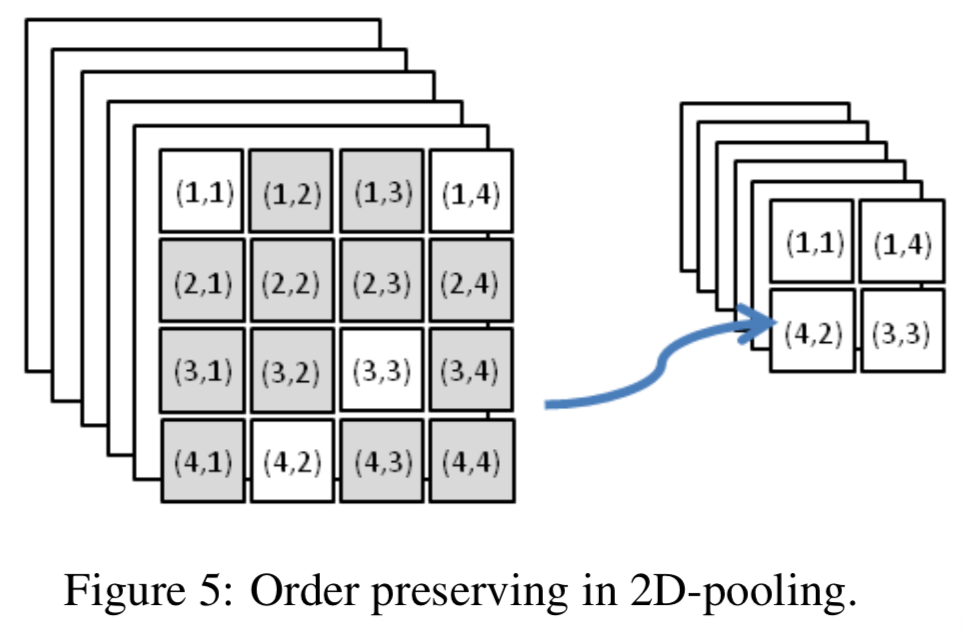
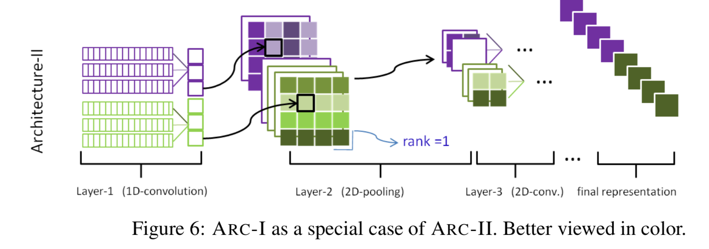
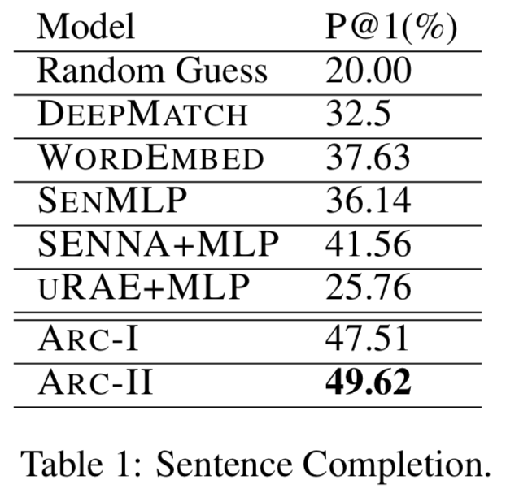
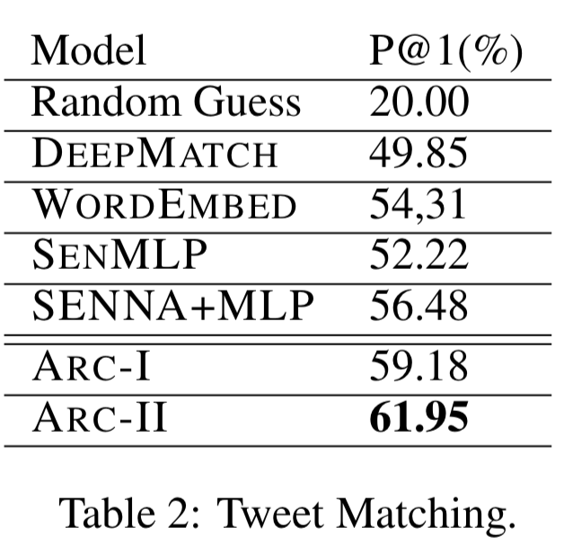
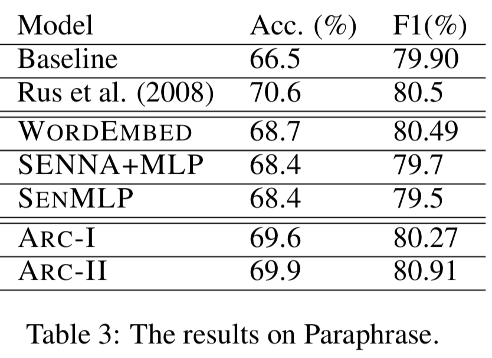

# Convoluntional Matching Model

## Abstract

- A successful matching algorithm needs to adequately model the **internal structures** of language objects and the **interaction** between them.
- The proposed models not only nicely represent the **hierarchical structures** of sentences with their layer-by-layer composition and pooling, but also capture the **rich matching patterns** at different levels.

## Introduction

* **Matching** two potentially **heterogenous language** objects is **central** to many natural language application. It **generalizes** the conventional **notion of similarity**.
* Our model is generic, requiring **no prior knowledge** of natural language.
* First, we devise novel **deep convolutional network architectures** that can naturally **combine** 1) the **hierarchical sentence modeling** through
  layer-by-layer composition and pooling, and 2) the **capturing of the rich matching patterns** at different levels of abstraction; 
* Second, we perform extensive empirical study on tasks with different
  scales and characteristics, and demonstrate the **superior** power of the proposed architectures over competitor methods.

## Convolutional Sentence Model

* Model takes as input the embedding of words in the sentence aligned sequentially, and summarize the meaning of a sentence through
  layers of convolution and pooling, until reaching a fixed length vectorial representation in the final layer.	
* We use convolution units with a **local “receptive field”** and **shared weights**, but we design a **large feature map** to adequately model the rich structures in the composition of words.
* 
* 如何理解该图片的模型结构？
* 数学公式详见论文，与常规CNN基本一致。

### Max-Pooling

* It **shrinks** the size of the representation by half, thus quickly
  absorbs the differences in length for sentence representation.
* It **filters out** undesirable composition of words.

### Length Variability

* (After zero-padding) To eliminate the boundary effect caused by the great variability of sentence lengths, we add to the convolutional unit a **gate** which **sets the output vectors to all-zeros if the input is all zeros**. 	

  $$z_i^{(l,f)}(x)=g(z^{(l-1)})\cdot \sigma (w^{(l,f)}z^{(l-1)}+b^{l,f})$$

* Where g(v) = 0 if all the elements in vector v equals 0, otherwise g(v) = 1. 

### Some Analysis

* 
* 如何跟之前的结构联系起来？
* 浅层CNN拥有 local convoytions 和 a global pooling。Since the sentence-
  level sequential order is inevitably **lost in the global pooling**, the model is **incapable of modeling more complicated structures.**
* 浅层CNN是该模型的特殊情况。		

## Convolutional Matching Models

### ARC-I

* 
* 多层感知机的作用？最后不是相当于线性函数吗？
* 不足：该结构先分别获得每个句子的表示，再进行比较。容易失去句子表示之前的重要细节，原文： It **defers the interaction** between two sentences(in the final MLP) to until their individual representation matures (in theconvolution model), therefore runs **at the risk of losing details** important for the match-ing task in representing the sen-tences
* In other words, in the forward phase (prediction), the representation of each sentence is formed without knowledge of each other. (在获取句子表示之前，互相不认识)

### ARC-II

* 在获得最终的表示之前，让两个句子先见面。（ Let two sentences
  meet before their own high-level representations mature.）

* 

* 公式不重要，重点在于模型的结构，维度，意义。

* 经过一维卷积，每个特征图得到一个二维矩阵。该矩阵包含了两个句子所有位置组合的信息。

* 1D convolution -> 2D max-pooling -> 2D convolution

* This pooling has different mechanism as in the 1D case, for it selects not only among **compositions on different segments** but also among **different local matchings**.

* > 首先要讲解的是李航老师提出的基于CNN的交互式处理思想的模型，就是提取两个句子中的所有位置的组合，利用1d convolution进行卷积，这样就会得到一个二维的矩阵结构，矩阵中每个元素带表了原始句子中两个部分信息交互的结果。接下来采取图像处理类似的方法，即通过一系列的2d nvolution 和pooling最后把两个句子一起卷成一个向量，最终结果的预测也是基于这个向量的。由于在卷积的过程中充分的考虑了两个句子之间的交互性，因此较第一种方法更完备的考虑了句子之间的所有交互属性，故该方法的效果更好。

### Some Analysis

* 保留位置信息

  

* 泛化性：ARC-I 是 ARC-II的特殊情况。

  

## Training

* $$e(x,y^+,y^-; \theta)=max(0,1+s(x,y^-)-s(x,y^+))$$

* 详细超参数见论文

## Experiments

### Experiment I: Sentence Completion

* Capture the **correspondence** between two clauses within a sentence.

* $S_X$, $S_Y$, divided by one comma. The task is then to **recover** the original second clause for any given first clause.

  * We deliberately make the task harder by using **negative second clauses** similar to the original ones, both in training and testing.

* $S_X$: Although the state has only four votes in the Electoral College, 

  $S_Y^+$: its loss would be a symbolic blow to republican presidential candi

  date Bob Dole.
  $S_Y^-$: but it failed to garner enough votes to override an expected veto by

  president Clinton.

* All models are trained on **3 million** triples and tested on 50K positive pairs.

* 

  ​	

### Experiment II: Matching A Response to A Tweet

* We trained our model with **4.5 million** original (tweet, response)
  pairs collected from Weibo.

  * Compared to Experiment I, the writing style is obviously more **free and informal**. 

* For each positive pair, we find ten random responses as negative examples, rendering **45 million triples** for training.

* $S_X$: Damn, I have to work overtimethis weekend!

  $S_Y^+$: Try to have some rest buddy.

  $S^-_Y$: It is hard to find a job, better start polishing your resume.

* Test the matching model on their ability to **pick the original response ** from **four random negatives**.

* 

### Experiment III: Paraphrase Identification

* Paraphrase identification aims to determine whether two sentences have **the same meaning**, a problem considered a **touchstone (标准) of natural language understanding**.
* The benchmark MSRP dataset which contains **4,076** instances for training and **1,725** for test. 
* Our model is not specially tailored for modeling **synonymy**, and generally requires ≥100K instances to work favorably. 
* Our generic matching models still manage to perform reasonably well.
* 

## Conclusion

- We propose **deep convolutional architecture**s for matching natural language sentences, which can nicely **combine** the **hierarchical** **modeling of individual sentences** and the **patterns of their matching**.
- Empirical study shows our models can **outperform** competitors on a variety of matching tasks.

##  参考文献

http://blog.csdn.net/guoyuhaoaaa/article/details/53129309				
​		
​	

​			
​		
​	

​			
​		
​	
